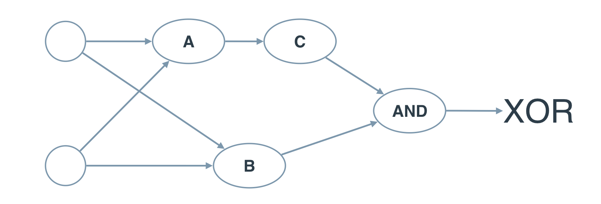

#  **PAUL STANDLEY**


## Bertelsmann Tech Scholarship Challenge Course - AI Track Nanodegree Program

---

### CMD

```CMD

pip install pandas

cd Perceptrons-Logical-Operators

python and.py

```

---

## Perceptrons logic gates

### __AND GATE__


### __OR GATE__


### __AND TO THE OR GATE__


### __XOR GATE__


---

The multi-layer perceptron below calculates __XOR__.

Each perceptron is a logic operation of __AND__, __OR__, and __NOT__.

However, the perceptrons __A__, __B__, and __C__ don't indicate their operation.

In the following quiz, set the correct operations for the perceptrons to calculate __XOR__.



And if we introduce the __NAND__ operator as the combination of __AND__ and __NOT__,

then we get the following two-layer perceptron that will model __XOR__.

That's our first neural network! **:-)**


