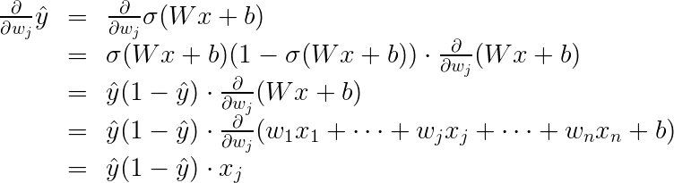

# Gradient Descent

[Back](../README.md)

## In order to minimize the error function, we need to take some derivatives

### Sigmoid function

### σ′ (x)=σ(x)(1−σ(x))

### The reason for this is the following, we can calculate it using the quotient formula

And now, let's recall that if we have mm points labelled

x^{(1)}, x^{(2)}, \ldots, x^{(m)},x (1) ,x (2) ,…,x (m) ,

### the error formula is

#### __E=− m 1 ∑ i=1 m (y i ln(y i ^ )+(1−y i )ln(1− y i ^ ))__

where the prediction is given by __\hat{y_i} = \sigma(Wx^{(i)} + b). y i^ =σ(Wx (i) +b).__

Our goal is to calculate the gradient of __E,E, at a point x = (x_1, \ldots, x_n),x=(x 1 ,…,x n )__

### Given by the partial derivatives

#### __∇E=( ∂w 1∂ E,⋯, ∂w n ∂ E, ∂b ∂​ E)__

To simplify our calculations, we'll actually think of the error that each point produces, and calculate the derivative of this error. The total error, then, is the average of the errors at all the points. The error produced by each point is, simply,

#### __E=−yln( y ^ )−(1−y)ln(1− y ^ )__

In order to calculate the derivative of this error with respect to the weights, we'll first calculate __\frac{\partial}{\partial w_j} \hat{y}. ∂w j ∂ y^__ . Recall that __\hat{y} = \sigma(Wx+b), y^ =σ(Wx+b)__, so

The last equality is because the only term in the sum which is not a constant with respect to w_jw j is precisely w_j x_j,w j x
j , which clearly has derivative x_j.x j.

Now, we can go ahead and calculate the derivative of the error EE at a point x,x, with respect to the weight w_j.w j

#### A similar calculation will show us that

This actually tells us something very important. For a point with coordinates __(x_1, \ldots, x_n),(x 1 ,…,x n )__, label __y,y,__ and prediction __\hat{y}, y^__, the gradient of the error function at that point is

#### __(−(y− y^ )x 1 ,⋯,−(y− y^ )x n ,−(y− y^ ))__

In summary, the gradient is

#### __∇E=−(y− y^ )(x 1 ,…,x n ,1)__

If you think about it, this is fascinating. The gradient is actually a scalar times the coordinates of the point! And what is the scalar? Nothing less than a multiple of the difference between the label and the prediction

[Back](../README.md)
