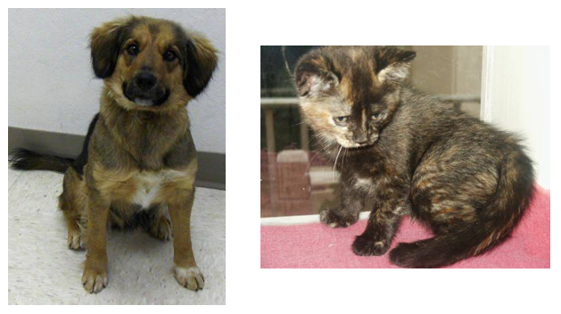

# Loading Image Data

## [Back](../README.md)

So far we've been working with fairly artificial datasets that you wouldn't typically be using in real projects.

Instead, you'll likely be dealing with full-sized images like you'd get from smart phone cameras.

In this notebook, we'll look at how to load images and use them to train neural networks.

We'll be using a [dataset of cat and dog](https://www.kaggle.com/c/dogs-vs-cats) photos available from Kaggle. Here are a couple example images



We'll use this dataset to train a neural network that can differentiate between cats and dogs.

These days it doesn't seem like a big accomplishment, but five years ago it was a serious challenge for computer vision systems.

```py

%matplotlib inline
%config InlineBackend.figure_format = 'retina'

import matplotlib.pyplot as plt

import torch
from torchvision import datasets, transforms

import helper

```

The easiest way to load image data is with datasets.ImageFolder from torchvision [(documentation)](http://pytorch.org/docs/master/torchvision/datasets.html#imagefolder).

In general you'll use ImageFolder like so:

```py

dataset = datasets.ImageFolder('path/to/data', transform=transform)

```

where __'path/to/data'__ is the file path to the data directory and transform is a sequence of processing steps built with the transforms module from torchvision.

ImageFolder expects the files and directories to be constructed like so:

```py

root/dog/xxx.png
root/dog/xxy.png
root/dog/xxz.png

root/cat/123.png
root/cat/nsdf3.png
root/cat/asd932_.png

```

where each class has it's own directory __(cat and dog)__ for the images.

The images are then labeled with the class taken from the directory name. So here, the image __123.png__ would be loaded with the class label cat.

You can download the dataset already structured like this from [here](https://s3.amazonaws.com/content.udacity-data.com/nd089/Cat_Dog_data.zip).

I've also split it into a training set and test set.

---

### Transforms

When you load in the data with ImageFolder, you'll need to define some transforms.

For example, the images are different sizes but we'll need them to all be the same size for training.

You can either resize them with transforms.Resize() or crop with

transforms.CenterCrop(),

transforms.RandomResizedCrop(), etc.

We'll also need to convert the images to PyTorch tensors with transforms.ToTensor().

Typically you'll combine these transforms into a pipeline with transforms.Compose(),

which accepts a list of transforms and runs them in sequence.

It looks something like this to scale, then crop, then convert to a tensor

```py

transform = transforms.Compose([transforms.Resize(255),
                                transforms.CenterCrop(224),
                                transforms.ToTensor()])

```

There are plenty of transforms available, I'll cover more in a bit and you can read through the [documentation](http://pytorch.org/docs/master/torchvision/transforms.html).

### Data Loaders

With the ImageFolder loaded, you have to pass it to a DataLoader.

The DataLoader takes a dataset (such as you would get from ImageFolder) and returns batches of images and the corresponding labels.

You can set various parameters like the batch size and if the data is shuffled after each epoch.

```py

dataloader = torch.utils.data.DataLoader(dataset, batch_size=32, shuffle=True)

```

Here dataloader is a [generator](https://jeffknupp.com/blog/2013/04/07/improve-your-python-yield-and-generators-explained/). To get data out of it, you need to loop through it or convert it to an iterator and call next().

```py

# Looping through it, get a batch on each loop
for images, labels in dataloader:
    pass

# Get one batch
images, labels = next(iter(dataloader))

```

Exercise: Load images from the Cat_Dog_data/train folder, define a few transforms, then build the dataloader.

```py

data_dir = 'Cat_Dog_data/train'

transform = transforms.Compose([transforms.Resize(255),
                                transforms.CenterCrop(224),
                                transforms.ToTensor()])
dataset = datasets.ImageFolder(data_dir, transform=transform)
dataloader = torch.utils.data.DataLoader(dataset, batch_size=32, shuffle=True)

# Run this to test your data loader
images, labels = next(iter(dataloader))
helper.imshow(images[0], normalize=False)

```

If you loaded the data correctly, you should see something like this (your image will be different):


---
