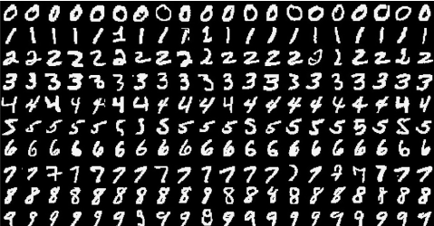

# Neural networks with PyTorch

[Back](../README.md)

## Deep learning networks tend to be massive with dozens or hundreds of layers, that's where the term "deep" comes from.

You can build one of these deep networks using only weight matrices as we did in the previous notebook, but in general it's very cumbersome and difficult to implement.

PyTorch has a nice module nn that provides a nice way to efficiently build large neural networks.

---

Now we're going to build a larger network that can solve a (formerly) difficult problem, identifying text in an image.

Here we'll use the MNIST dataset which consists of greyscale handwritten digits. Each image is 28x28 pixels, you can see a sample below



Our goal is to build a neural network that can take one of these images and predict the digit in the image.

First up, we need to get our dataset. This is provided through the torchvision package.

The code below will download the MNIST dataset, then create training and test datasets for us.

---

```py

# Import necessary packages

%matplotlib inline
%config InlineBackend.figure_format = 'retina'

import numpy as np
import torch

import helper

import matplotlib.pyplot as plt

```

```py

### Run this cell

from torchvision import datasets, transforms

# Define a transform to normalize the data
transform = transforms.Compose([transforms.ToTensor(),
                              transforms.Normalize((0.5,), (0.5,)),
                              ])

# Download and load the training data
trainset = datasets.MNIST('~/.pytorch/MNIST_data/', download=True, train=True, transform=transform)
trainloader = torch.utils.data.DataLoader(trainset, batch_size=64, shuffle=True)

```

We have the training data loaded into trainloader and we make that an iterator with iter(trainloader). Later, we'll use this to loop through the dataset for training, like

```py

for image, label in trainloader:

  # do things with images and labels
  
```

You'll notice I created the trainloader with a batch size of 64, and shuffle=True.

The batch size is the number of images we get in one iteration from the data loader and pass through our network, often called a batch.

And shuffle=True tells it to shuffle the dataset every time we start going through the data loader again. But here I'm just grabbing the first batch so we can check out the data.

We can see below that images is just a tensor with size (64, 1, 28, 28). So, 64 images per batch, 1 color channel, and 28x28 images.

```py

dataiter = iter(trainloader)
images, labels = dataiter.next()
print(type(images))
print(images.shape)
print(labels.shape)

```

This is what one of the images looks like.

```py

plt.imshow(images[1].numpy().squeeze(), cmap='Greys_r')

```

First, let's try to build a simple network for this dataset using weight matrices and matrix multiplications.

Then, we'll see how to do it using PyTorch's nn module which provides a much more convenient and powerful method for defining network architectures.

The networks you've seen so far are called fully-connected or dense networks. Each unit in one layer is connected to each unit in the next layer. In fully-connected networks, the input to each layer must be a one-dimensional vector (which can be stacked into a 2D tensor as a batch of multiple examples).

However, our images are 28x28 2D tensors, so we need to convert them into 1D vectors. Thinking about sizes, we need to convert the batch of images with shape (64, 1, 28, 28) to a have a shape of (64, 784), 784 is 28 times 28. This is typically called flattening, we flattened the 2D images into 1D vectors.

Previously you built a network with one output unit. Here we need 10 output units, one for each digit. We want our network to predict the digit shown in an image, so what we'll do is calculate probabilities that the image is of any one digit or class.

This ends up being a discrete probability distribution over the classes (digits) that tells us the most likely class for the image. That means we need 10 output units for the 10 classes (digits). We'll see how to convert the network output into a probability distribution next.

__Exercise: Flatten the batch of images images. Then build a multi-layer network with 784 input units, 256 hidden units, and 10 output units using random tensors for the weights and biases. For now, use a sigmoid activation for the hidden layer. Leave the output layer without an activation, we'll add one that gives us a probability distribution next.__

```py

## Solution
def activation(x):
    return 1/(1+torch.exp(-x))

# Flatten the input images
inputs = images.view(images.shape[0], -1)

# Create parameters
w1 = torch.randn(784, 256)
b1 = torch.randn(256)

w2 = torch.randn(256, 10)
b2 = torch.randn(10)

h = activation(torch.mm(inputs, w1) + b1)

out = torch.mm(h, w2) + b2

```


Here we see that the probability for each class is roughly the same. This is representing an untrained network, it hasn't seen any data yet so it just returns a uniform distribution with equal probabilities for each class.

To calculate this probability distribution, we often use the softmax function.

What this does is squish each input  𝑥𝑖  between 0 and 1 and normalizes the values to give you a proper probability distribution where the probabilites sum up to one.

__Exercise: Implement a function softmax that performs the softmax calculation and returns probability distributions for each example in the batch. Note that you'll need to pay attention to the shapes when doing this. If you have a tensor a with shape (64, 10) and a tensor b with shape (64,), doing a/b will give you an error because PyTorch will try to do the division across the columns (called broadcasting) but you'll get a size mismatch. The way to think about this is for each of the 64 examples, you only want to divide by one value, the sum in the denominator. So you need b to have a shape of (64, 1). This way PyTorch will divide the 10 values in each row of a by the one value in each row of b. Pay attention to how you take the sum as well. You'll need to define the dim keyword in torch.sum. Setting dim=0 takes the sum across the rows while dim=1 takes the sum across the columns.__

```py

## Solution
def softmax(x):
    return torch.exp(x)/torch.sum(torch.exp(x), dim=1).view(-1, 1)

probabilities = softmax(out)

# Does it have the right shape? Should be (64, 10)
print(probabilities.shape)
# Does it sum to 1?
print(probabilities.sum(dim=1))

```

---

## Building networks with PyTorch

PyTorch provides a module nn that makes building networks much simpler. Here I'll show you how to build the same one as above with 784 inputs, 256 hidden units, 10 output units and a softmax output.

```py

from torch import nn

class Network(nn.Module):
    def __init__(self):
        super().__init__()
        
        # Inputs to hidden layer linear transformation
        self.hidden = nn.Linear(784, 256)
        # Output layer, 10 units - one for each digit
        self.output = nn.Linear(256, 10)
        
        # Define sigmoid activation and softmax output 
        self.sigmoid = nn.Sigmoid()
        self.softmax = nn.Softmax(dim=1)
        
    def forward(self, x):
        # Pass the input tensor through each of our operations
        x = self.hidden(x)
        x = self.sigmoid(x)
        x = self.output(x)
        x = self.softmax(x)
        
        return x

```

### Let's go through this bit by bit

```py

class Network(nn.Module):

```

Here we're inheriting from nn.Module. Combined with super().\_\_init\_\_() this creates a class that tracks the architecture and provides a lot of useful methods and attributes.

It is mandatory to inherit from nn.Module when you're creating a class for your network. The name of the class itself can be anything.

```py

self.hidden = nn.Linear(784, 256)

```

This line creates a module for a linear transformation,  __𝑥𝐖+𝑏__ , with __784 inputs__ and __256 outputs__ and assigns it to self.hidden.

The module automatically creates the weight and bias tensors which we'll use in the forward method.

You can access the weight and bias tensors once the network __(net)__ is created with net.hidden.weight and net.hidden.bias.

```py

self.output = nn.Linear(256, 10)

```

Similarly, this creates another linear transformation with 256 inputs and 10 outputs.

```py

self.sigmoid = nn.Sigmoid()
self.softmax = nn.Softmax(dim=1)

```

Here I defined operations for the sigmoid activation and softmax output. Setting dim=1 in nn.Softmax(dim=1) calculates softmax across the columns.

```py

def forward(self, x):

```

PyTorch networks created with __nn.Module__ must have a forward method defined. It takes in a tensor __x__ and passes it through the operations you defined in the __\_\_init\_\___ method.

```py

x = self.hidden(x)
x = self.sigmoid(x)
x = self.output(x)
x = self.softmax(x)

```

Here the input tensor __x__ is passed through each operation a reassigned to __x__. We can see that the input tensor goes through the hidden layer, then a sigmoid function, then the output layer, and finally the softmax function.

It doesn't matter what you name the variables here, as long as the inputs and outputs of the operations match the network architecture you want to build.

The order in which you define things in the __\_\_init\_\___ method doesn't matter, but you'll need to sequence the operations correctly in the forward method.

### Now we can create a Network object

```py

# Create the network and look at it's text representation
model = Network()
model

```

You can define the network somewhat more concisely and clearly using the __torch.nn.functional__ module.

This is the most common way you'll see networks defined as many operations are simple element-wise functions. We normally import this module as __F__, import __torch.nn.functional as F__.

```py

import torch.nn.functional as F

class Network(nn.Module):
    def __init__(self):
        super().__init__()
        # Inputs to hidden layer linear transformation
        self.hidden = nn.Linear(784, 256)
        # Output layer, 10 units - one for each digit
        self.output = nn.Linear(256, 10)
        
    def forward(self, x):
        # Hidden layer with sigmoid activation
        x = F.sigmoid(self.hidden(x))
        # Output layer with softmax activation
        x = F.softmax(self.output(x), dim=1)
        
        return x

```


