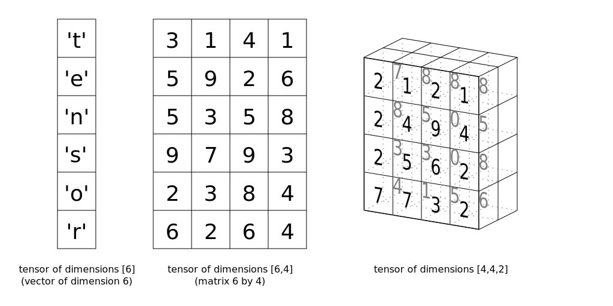

# Tensors

It turns out neural network computations are just a bunch of linear algebra operations on tensors, a generalization of matrices.

A vector is a 1-dimensional tensor, a matrix is a 2-dimensional tensor, an array with three indices is a 3-dimensional tensor (RGB color images for example).

The fundamental data structure for neural networks are tensors and PyTorch (as well as pretty much every other deep learning framework) is built around tensors.

[Back](../README.md)
